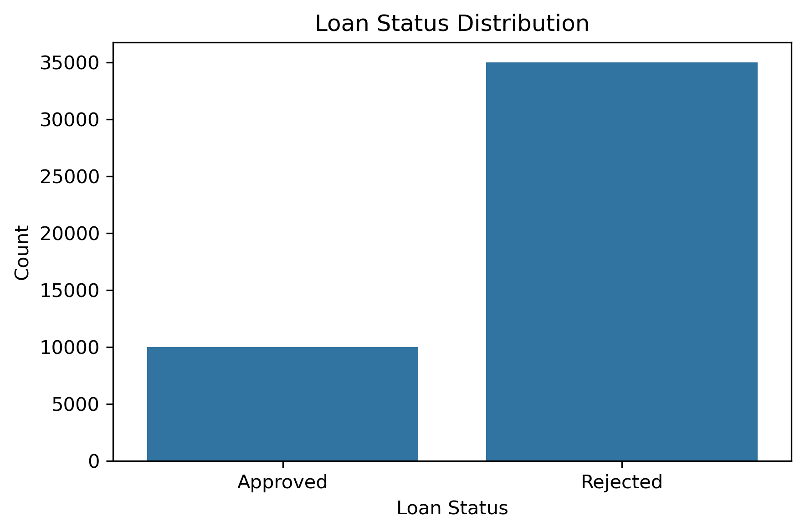
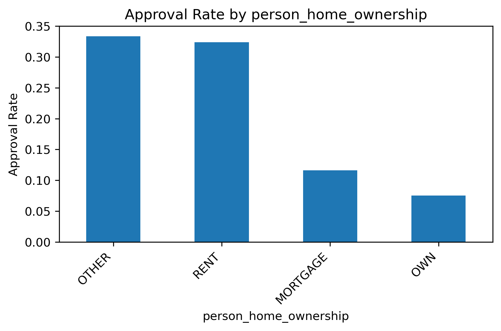
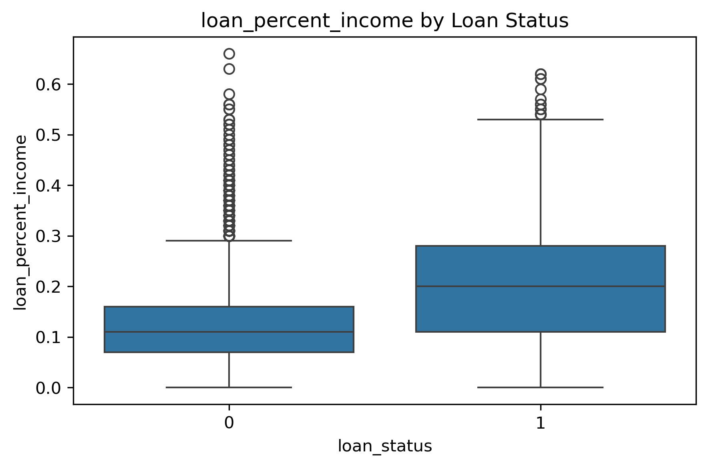
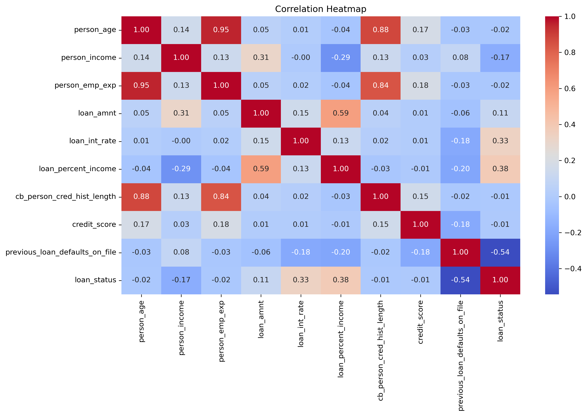
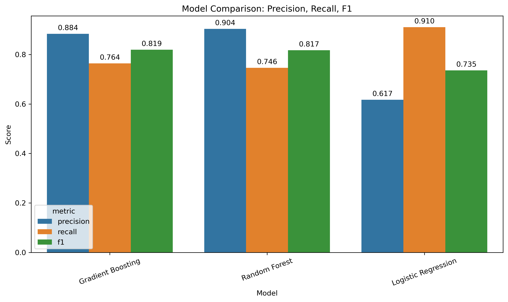
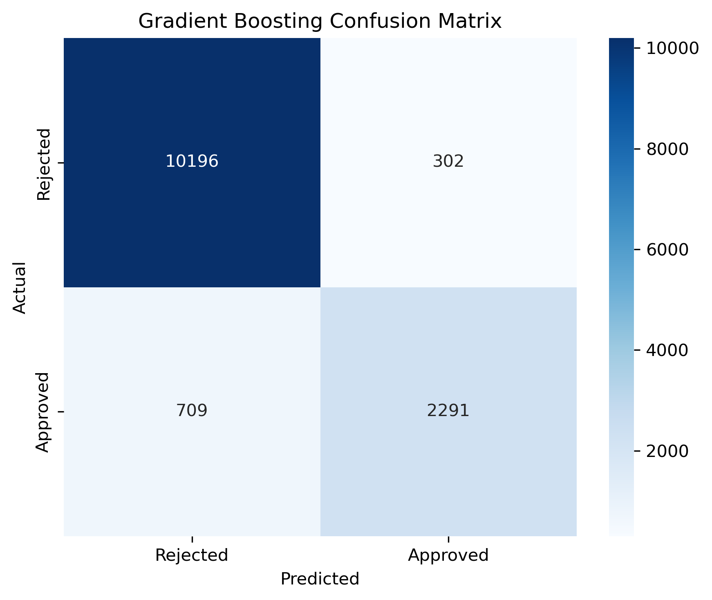
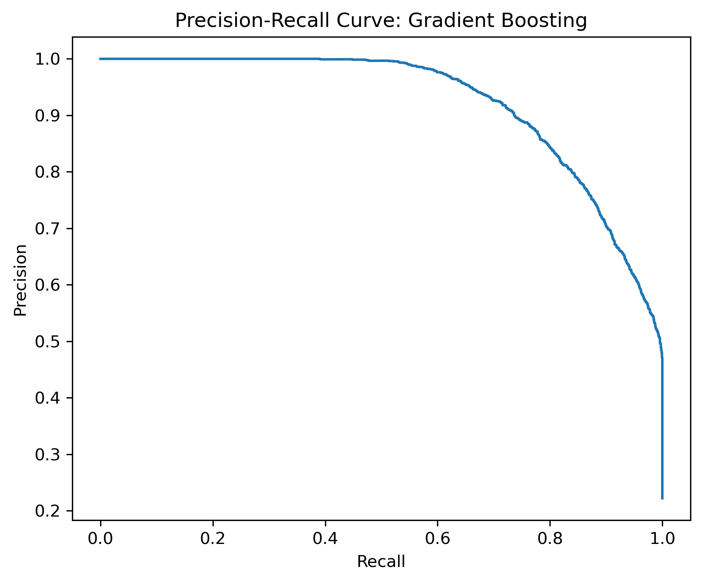
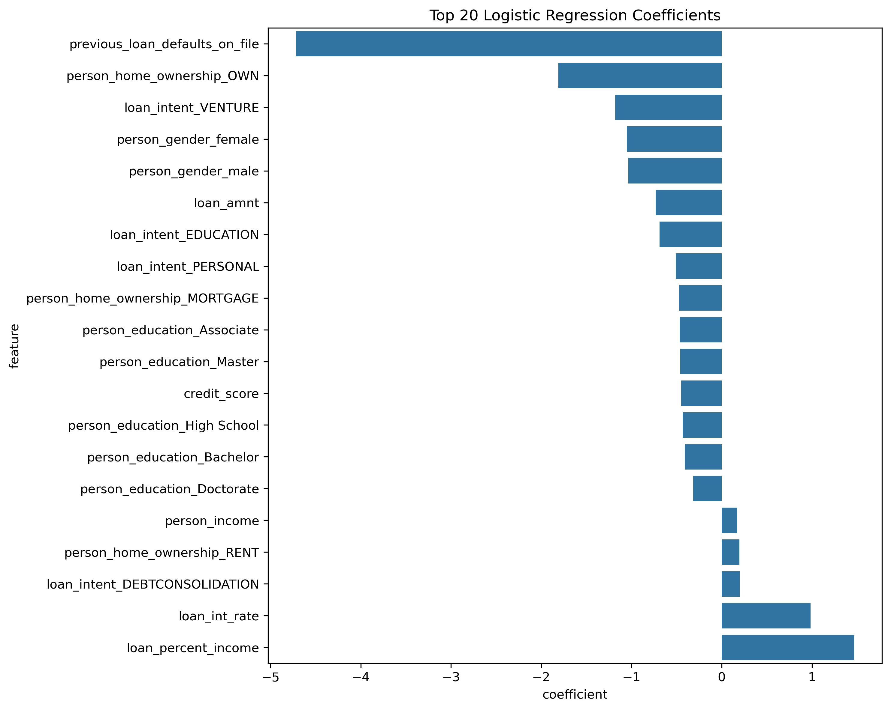
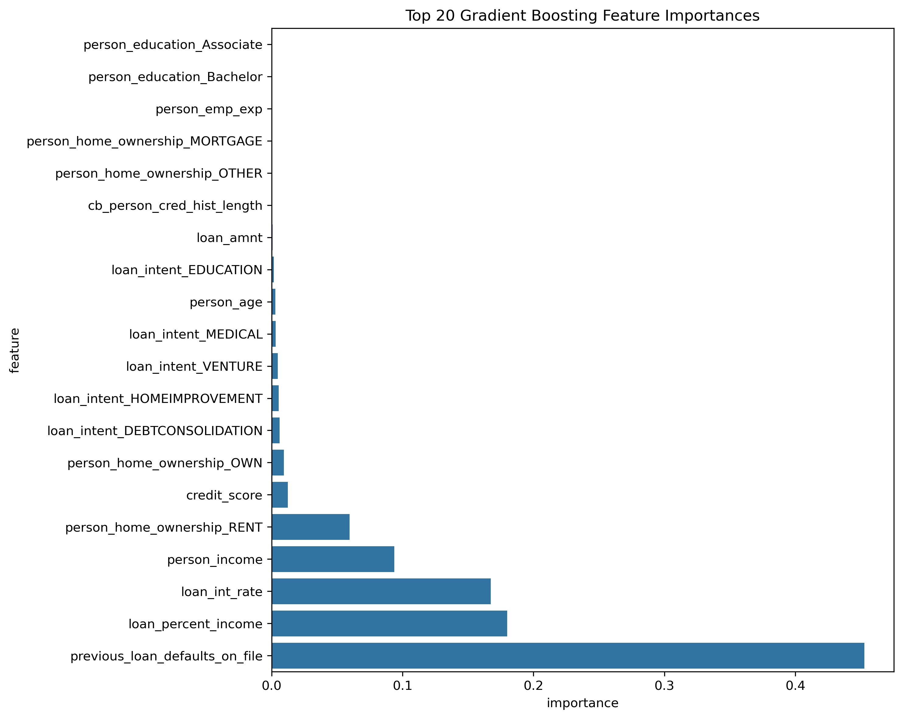

# Evaluating Machine Learning Models for Loan Approval Classification
🏦 Lending context | 🤖 Model comparison | ⚖️ Threshold tuning | 🔍 Interpretability

*Taylor Verschoor*  
*MIS 5460 Final Project*

Loan approval is a high-stakes decision problem. Lenders need to manage risk, protect profitability, and avoid rejecting applicants who may actually be creditworthy. In this project, I compared several machine learning models to predict loan approval outcomes and focused on three key questions:

- Which model performs best overall?
- How should performance be evaluated when the target is imbalanced?
- Which applicant and loan-related features matter most in the final predictions?

---

## 💼 Why This Problem Matters

Loan approval decisions are more complicated than simply saying yes or no to an applicant. A false approval may increase credit risk, but a false rejection may turn away a qualified borrower. That makes loan approval a strong use case for predictive modeling, especially when decisions need to be made consistently across a large number of applications.

My goal was not just to build an accurate model, but to compare model behavior, account for class imbalance, and interpret the factors that were most associated with approval outcomes.

---

## 📊 The Data

Dataset source: [Loan Approval Classification Dataset on Kaggle](https://www.kaggle.com/datasets/taweilo/loan-approval-classification-data/data)

The dataset used in this project was the **Loan Approval Classification Dataset** from Kaggle. It contains approximately **45,000 loan applications** and includes **14 total columns**: **13 predictor variables** and **1 binary target variable**, `loan_status`. The features include applicant, credit, and loan-related variables such as age, income, employment experience, home ownership, loan amount, interest rate, loan percent of income, credit history length, credit score, and previous loan defaults.  

Although the dataset is synthetic, it still provides a realistic structure for comparing machine learning models and analyzing approval decision tradeoffs in a controlled setting.

### Key Variables

- `person_age`
- `person_income`
- `person_emp_exp`
- `person_home_ownership`
- `loan_amnt`
- `loan_int_rate`
- `loan_percent_income`
- `cb_person_cred_hist_length`
- `credit_score`
- `previous_loan_defaults_on_file`

---

## Dataset at a Glance

Before modeling, I summarized the dataset to confirm its structure and overall quality.

| Item | Value |
|---|---:|
| Rows | 45,000 |
| Columns | 14 |
| Predictor Variables | 13 |
| Target Variable | `loan_status` |
| Approval Rate | 22.2% |
| Missing Values | 0 |
| Duplicate Rows | 0 |

This quick summary helped confirm that the dataset was large enough for model comparison and that the main challenge was not missing data, but the imbalance between approved and rejected applications.

---

## ⚖️ A Key Challenge: Class Imbalance

One of the first things I noticed in the data was that the target variable was imbalanced. Rejected applications made up the majority class, while approved applications made up the minority class. (~77% rejected)

That mattered because accuracy alone could be misleading. A model might look strong overall while still performing poorly on the minority approval class. To address this, I used:

- a **stratified train/test split**
- **precision, recall, F1 score, ROC-AUC, and PR-AUC**
- **threshold optimization** for the final model

### Target Distribution

<p align="center">
  
</p>

*Figure 1. Distribution of rejected and approved loan applications.*

This class imbalance shaped the entire modeling strategy and made balanced evaluation more important than any single summary metric.

### Example: Stratified Train/Test Split

To preserve the class proportions of the imbalanced target variable, I used a stratified train/test split:

```python
X_train, X_test, y_train, y_test = train_test_split(
    X, y, test_size=0.30, stratify=y, random_state=42
)
```

---

## 📈 Early Patterns in the Data

Before training models, I used exploratory data analysis to better understand the structure of the dataset and identify variables that appeared related to approval outcomes.

### Approval Rates by Home Ownership

<p align="center">
  
</p>

*Figure 2. Approval rates by home ownership category.*

Approval rates varied across home ownership groups, suggesting that this variable could be useful in classification. Later in the project, home ownership also appeared in both the Logistic Regression coefficients and the tree-based feature importance results.

### 💵 Loan Percent Income by Loan Status

<p align="center">
  
</p>

*Figure 3. Distribution of `loan_percent_income` by loan approval status.*

This box plot compares `loan_percent_income` across rejected and approved applications. The line inside each box represents the median, the box shows the middle 50% of observations, and the whiskers show the broader spread of the data.

In this dataset, the approved group had a higher median `loan_percent_income` than the rejected group, and the approved group also showed more spread. That made this variable especially interesting because it visually separated the two classes and later became one of the most important predictors in the final models.

### Correlation Heatmap

<p align="center">
  
</p>

*Figure 4. Correlation heatmap showing relationships among key numeric predictors and loan status.*

The heatmap gave a high-level view of linear relationships among the numeric features. The strongest correlation with `loan_status` appeared for `previous_loan_defaults_on_file` (-0.54), followed by `loan_percent_income` (0.38) and `loan_int_rate` (0.33). It also showed strong relationships among some applicant history variables, such as age and employment experience.

This visualization was useful for identifying broad patterns early, but it also reinforced the need to test multiple model types rather than relying on simple correlation alone.

---

## ⚙️ Modeling Approach

To compare model performance, I built three classification models:

- **Logistic Regression**
- **Random Forest**
- **Gradient Boosting**

Logistic Regression served as the interpretable baseline, while the two tree-based models were used to capture more complex nonlinear relationships.

Because the target was imbalanced, I emphasized:

- precision
- recall
- F1 score

I also used cross-validation to check whether the model results were stable across multiple splits.

---

## 🆚 Comparing the Models

The first major takeaway was that Logistic Regression was useful as a baseline, but the strongest overall performance came from the two tree-based models.

### Model Comparison

<p align="center">
  
</p>

*Figure 5. Comparison of precision, recall, and F1 score across candidate models.*

This chart shows the core tradeoff clearly:

- Logistic Regression had high recall, but much lower precision
- Random Forest and Gradient Boosting were much more balanced
- the top two models were extremely close overall

### Test-Set Performance

| Model | Accuracy | Precision | Recall | F1 | ROC-AUC | PR-AUC |
|---|---:|---:|---:|---:|---:|---:|
| Logistic Regression | 0.8544 | 0.6169 | 0.9103 | 0.7354 | 0.9520 | 0.8483 |
| Random Forest | 0.9258 | 0.9035 | 0.7460 | 0.8172 | 0.9738 | 0.9277 |
| Gradient Boosting | 0.9251 | 0.8835 | 0.7637 | 0.8192 | 0.9713 | 0.9224 |

### Cross-Validation Summary

| Model | Mean CV F1 | Mean CV ROC-AUC |
|---|---:|---:|
| Logistic Regression | 0.7407 | 0.9540 |
| Random Forest | 0.8229 | 0.9748 |
| Gradient Boosting | 0.8196 | 0.9720 |

Random Forest and Gradient Boosting were very close. Random Forest was slightly stronger on some metrics, but Gradient Boosting had the highest **test-set F1 score**, which mattered most for this project because of the need to balance precision and recall under class imbalance.

For that reason, I selected **Gradient Boosting** as the final model. 🥇

---

## 🔬 Looking Beyond the Default Threshold

After choosing Gradient Boosting, I explored whether the default classification threshold of `0.50` was actually the best choice.

This turned out to be one of the most interesting parts of the project.

### Final Model Confusion Matrix

<p align="center">
  
</p>

*Figure 6. Confusion matrix for the final Gradient Boosting model using the default threshold.*

### 🎯 Threshold Comparison

| Threshold | Accuracy | Precision | Recall | F1 |
|---|---:|---:|---:|---:|
| 0.50 | 0.9251 | 0.8835 | 0.7637 | 0.8192 |
| 0.40 | 0.9210 | 0.8271 | 0.8147 | 0.8208 |

Lowering the threshold from **0.50 to 0.40** increased recall and slightly improved F1 score, while only modestly reducing precision and accuracy.

That matters because it shows that model performance depends on more than just the algorithm. It also depends on how predicted probabilities are converted into final decisions.

### Precision-Recall Curve

<p align="center">
  
</p>

*Figure 7. Precision-recall curve for the final Gradient Boosting model.*

The precision-recall curve makes that tradeoff visible across thresholds. In an imbalanced classification problem, this is often more informative than accuracy alone.

---

## 🔍 What the Models Found Most Important

One of the main goals of this project was to go beyond prediction and understand **why** the model made the decisions it did.

### Logistic Regression Coefficients

<p align="center">
  
</p>

*Figure 8. Top Logistic Regression coefficients by magnitude.*

Logistic Regression helped show the direction and relative strength of the predictors in the baseline model. One of the clearest patterns was that `previous_loan_defaults_on_file` had the strongest negative relationship with approval.

### Gradient Boosting Feature Importance

<p align="center">
  
</p>

*Figure 9. Top feature importances from the final Gradient Boosting model.*

Across models, the same features appeared repeatedly:

- `previous_loan_defaults_on_file`
- `loan_percent_income`
- `loan_int_rate`
- `person_income`

That consistency made the results more credible, because the strongest predictors were not changing wildly across model types.

One interesting takeaway was that **credit score mattered, but not as strongly as I originally expected**. In this dataset, prior defaults and loan burden were more influential.

---

## ✅ Key Takeaways

This project highlighted several important ideas:

- **Gradient Boosting** was the best final model because it provided the strongest balance between precision and recall.
- **Class imbalance** required evaluation beyond accuracy alone.
- **Threshold optimization** improved the practical decision rule.
- **Prior defaults, loan burden, interest rate, and income** were the strongest and most consistent predictors.

Overall, the project showed that strong machine learning analysis is not just about choosing the highest-performing model. It is also about selecting the right metrics, understanding decision tradeoffs, and interpreting what the model is actually learning.

---

## ⚠️ Limitations

There are also important limitations to keep in mind:

- the dataset is **synthetic**, so the relationships may be cleaner than in real-world lending data
- the target reflects **approval decisions**, not long-term repayment or default outcomes
- threshold tuning here was used as a **project-level decision analysis**, not a separate production-style validation stage

Even with those limitations, the project provides a strong example of model comparison, imbalance-aware evaluation, threshold analysis, and interpretability in a lending context. 

**Opportunity to expand this process using repayment data to use in real-world settings!**

---

## Code and Supporting Files

The full implementation is available in the project notebook:

- [Loan_approval_classification.ipynb](Loan_approval_classification.ipynb)

This notebook includes preprocessing, model training, evaluation, threshold optimization, and interpretability outputs used throughout this project.

> Note: If GitHub does not render the notebook preview correctly, the notebook can still be downloaded and opened locally in Jupyter or VS Code. The main outputs and visuals are also included throughout this README for easy review.

---

## Repository Contents

- `Loan_approval_classification.ipynb` — main notebook with code and outputs
- `loan_data.csv` — source dataset
- `README.md` — project summary and presentation narrative
- `images/` — figures used in the report and GitHub presentation

---

## Author

**Taylor Verschoor**  
MIS 5460 Final Project
